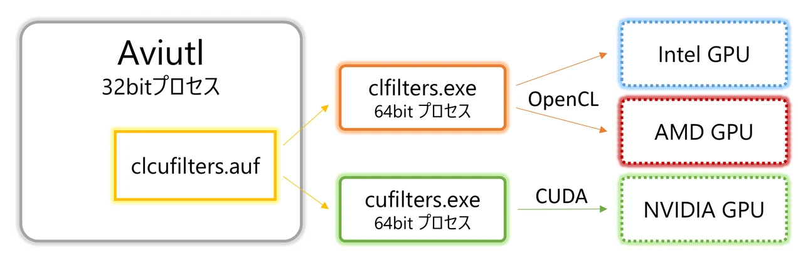
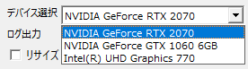
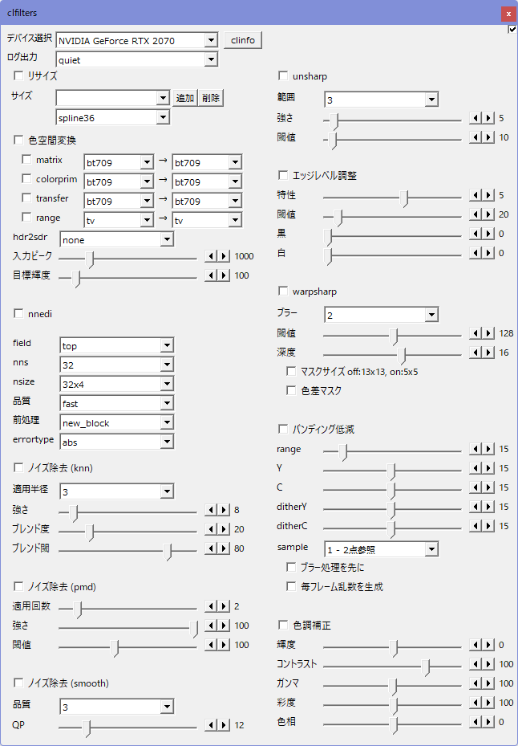
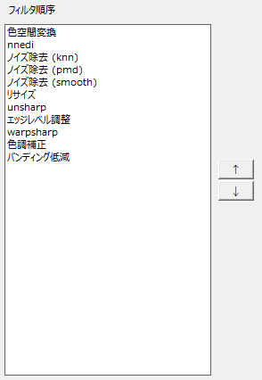

# clcufilters

clcufilters.auf は、Aviutl用のGPUフィルタです。複数のフィルタ処理をGPU上で連続して行うことで、フィルタをそれぞれ実行するのと比べてCPU - GPU間のデータ転送を削減でき、高速化が期待できます。

処理本体は別プロセスで行うつくりとなっており、NVIDIA GPUではcufilters.exeによりCUDAでフィルタ処理を、それ以外(Intel/AMD)のGPUではclfilters.exeによりOpenCLでフィルタ処理を行います。



これにより、

- Aviutl本体プロセスのメモリ使用量削減
- プロセス分離による安定性向上
- 特にCUDA関連の64bitプロセスでしか使用できない機能の活用

といったことを狙います。

## 想定動作環境

Windows 10/11 (x64)  
Aviutl 1.00 以降  
Intel / NVIDIA / AMD のGPUドライバのインストールされた環境  

32bit OSでは使用できません。

## clcufilters 使用にあたっての注意事項

無保証です。自己責任で使用してください。clcufiltersを使用したことによる、いかなる損害・トラブルについても責任を負いません。  

今後の更新でプロファイルの互換性がなくなるかもしれません。  
※非常にありえます。

## 使用方法

まず、使用するデバイスを選択してください。iGPU / dGPUどちらも利用可能です。

右側の [clinfo] ボタンでOpenCLの認識するGPUデバイスの詳細情報をテキストファイルに出力できます。



その後、適用するフィルタにチェックを入れ、パラメータ調整を行ってください。標準値は下記のとおりです。



## "OpenCLを使用できません。" と出てしまう

問題の確認方法、対処方法をまとめました。[こちら](./opencl_load_error.md)をご確認ください。

## 設定画面の詳細

### デバイス選択  
使用するデバイス(GPU)を選択します。

### clinfo  
現環境で認識しているデバイスのリストとその情報を指定のファイルに出力します。

### ログ出力  
ログ出力の段階を選択します。通常は、"quiet"で問題ありません。

quiet以外を選択した場合、ログは[patch.aul](https://www.nicovideo.jp/watch/sm39491708)等により表示可能なコンソールウィンドウに出力されます。また、「ファイルに出力」のチェックを入れることで、"cufilter.auf.log"にファイル出力することも可能です。

### フィルタ順序  


フィルタの適用順を並べ替えることができます。適用順を入れ替えたいフィルタを選択し、上下ボタンで移動してください。

### 色空間変換  
指定の色空間変換を行う。

- **パラメータ**
  - matrix=&lt;変換元&gt;→&lt;変換先&gt;  
    
  ```
    bt709, smpte170m, bt470bg, smpte240m, YCgCo, fcc, GBR, bt2020nc, bt2020c
  ```
  
  - colorprim=&lt;変換元&gt;→&lt;変換先&gt;  
  ```
    bt709, smpte170m, bt470m, bt470bg, smpte240m, film, bt2020
  ```
  
  - transfer=&lt;変換元&gt;→&lt;変換先&gt;  
  ```
    bt709, smpte170m, bt470m, bt470bg, smpte240m, linear,
    log100, log316, iec61966-2-4, iec61966-2-1,
    bt2020-10, bt2020-12, smpte2084, arib-std-b67
  ```
  
  - range=&lt;変換元&gt;→&lt;変換先&gt;  
  ```
    tv, full
  ```
  
  
  - hdr2sdr  
    tone-mappingを指定してHDRからSDRへの変換を行う。使用時には、matrix, colorprim, transfer 等の変換も同時に適切に指定してください。
    
    - none  (デフォルト)  
      hdr2sdrの処理を行うない。
  
    - hable    
      明部と暗部のディテールの両方をバランスよく保ちながら変換する。(ただし、やや暗めになる)
  
    - mobius  
      なるべく画面の明るさやコントラストを維持した変換を行うが、明部のディテールがつぶれる可能性がある。
    
    - reinhard  
        
    - bt2390  
      BT.2390で規定されるtone mapping。
  
  
  - 入力ピーク  (デフォルト= 1000)  
  
  - 目標輝度  (デフォルト= 100)  


### nnedi  
nnediによるインタレ解除を行う。基本的には片方フィールドは捨てて、もう片方のフィールドから
ニューラルネットを使って輪郭を補正しながらフレームを再構築することでインタレ解除するが、とても重い…。

- **パラメータ**
  - field  
    インタレ解除の方法。
    - top  
      トップフィールド維持
    - bottom  
      ボトムフィールド維持
  
  - nns  (デフォルト= 32)  
    ニューラルネットのニューロン数。
    - 16, 32, 64, 128, 256
  
  - nsize  (デフォルト= 32x4)  
    ニューラルネットが参照する近傍ブロックのサイズ。
    - 8x6, 16x6, 32x6, 48x6, 8x4, 16x4, 32x4
  
  - 品質  (デフォルト= fast)  
  
    - fast
  
    - slow  
      slowではfastのニューラルネットの出力に、もうひとつの
      ニューラルネットの出力をブレンドして品質を上げる(当然その分さらに遅い)。
  
  - 前処理 (デフォルト= new_block)  
    事前に前処理を行い、単純な補間で済ますか、ニューラルネットでの補正を行うか決定する。
    基本的にはエッジ近傍がニューラルネットでの補正の対象となり、ニューラルネットを使う頻度が下がることで処理が高速になる。
    
    - none  
      前処理を行わず、すべてのpixelをニューラルネットで再構成する。
  
    - original
    - new  
      前処理を行い、必要なところのみニューラルネットでの補正を行うようにする。originalとnewは方式が異なる。newのほうが速くなる傾向にある。
  
    - original_block
    - new_block  
      original/newのGPU最適化版。pixel単位の判定の代わりにブロック単位の判定を行う。
  
  - errortype (デフォルト= abs)  
    ニューラルネットの重みパラメータを選択する。
    - abs  
      絶対誤差を最小にするよう学習された重みを用いる。
    - square  
      二乗誤差を最小にするよう学習された重みを用いる。


### ノイズ除去 (smooth)  

- **パラメータ**
  - 品質  (デフォルト=3, 1-6)  
    処理の品質。値が大きいほど高精度だが遅くなる。
  
  - QP  (デフォルト=12, 1 - 63)    
    フィルタの強さ。

### ノイズ除去 (knn)  
強めのノイズ除去を行う。

- **パラメータ**
  - 適用半径  (デフォルト=3, 1-5)  
  
  - 強さ  (デフォルト=8, 0 - 100)  
    フィルタの強さ。
  
  - ブレンド度;  (デフォルト=20, 0 - 100)  
    ノイズ除去ピクセルへのオリジナルピクセルのブレンド度合い。
  
  - ブレンド閾   (デフォルト=80, 0 - 100)  
    エッジ検出の閾値。


### ノイズ除去 (pmd)  
正則化pmd法によるノイズ除去。弱めのノイズ除去を行いたいときに使用する。

- **パラメータ**
  - 適用回数  (デフォルト=2, 1- )  
    適用回数。デフォルトは2。
  
  - 強さ  (デフォルト=100, 0-100)  
    フィルタの強さ。
  
  - 閾値  (デフォルト=100, 0-255)  
    フィルタの輪郭検出の閾値。小さいほど輪郭を保持するようになるが、フィルタの効果も弱まる。


### リサイズ  
リサイズのアルゴリズムを指定できる。

- **パラメータ**
  | オプション名 | 説明 |
  |:---|:---|
  | spline16 | 4x4 Spline補間 |
  | spline36 | 6x6 Spline補間 |
  | spline64 | 8x8 Spline補間 |
  | lanczos2 | 4x4 lanczos補間 |
  | lanczos3 | 6x6 lanczos補間 |
  | lanczos4 | 8x8 lanczos補間 |
  | bilinear | 線形補間 |
  | bicubic  |  双三次補間 |


### unsharp  
輪郭・ディテール強調用のフィルタ。

- **パラメータ**
  - 範囲 (デフォルト=3, 1-9)  
    輪郭・ディテール検出の範囲。より大きな値とすることで、より広い範囲のディテールに反応して強調をかけるようになる。
  
  - 強さ (デフォルト=0, 0-100)  
    輪郭・ディテール強調の強さ。より大きな値とすることで、強く強調がかかる。
  
  - 閾値 (デフォルト=10, 0-255)  
    輪郭・ディテール検出の閾値。閾値以上の差異がある画素に対して、輪郭強調を行う。


### エッジレベル調整  
輪郭強調用のフィルタ。

- **パラメータ**
  - 特性 (デフォルト=5, -31 - 31)  
    輪郭強調の強さ。より大きな値とすることで、輪郭強調が強力になる。
  
  - 閾値 (デフォルト=20, 0 - 255)  
    輪郭強調を行わないようにするノイズの閾値。より大きな値ほど大きな輝度の変化をノイズとして扱うようになる。
  
  - 黒 (デフォルト=0, 0-31)  
    輪郭の黒い部分について、より黒くシュートさせて輪郭を強調するようにする。
  
  - 白 (デフォルト=0, 0-31)  
    輪郭の白い部分について、より白くシュートさせて輪郭を強調するようにする。


### warpsharp  
細線化フィルタ。輪郭調整用のフィルタ。

- **パラメータ**
  - ブラー  (デフォルト=2)  
    blur処理を行う回数。値をあげるほどフィルタの強度が弱まる。
  
  - 閾値 (デフォルト=128, 0 - 255)  
    輪郭検出の閾値。値をあげるほどフィルタの強度が強まる。
    
  - 深度 (デフォルト=16, -128 - 128)  
    warpの深度。値をあげるほどフィルタの強度が強まる。
  
  - マスクサイズ  (デフォルト=オフ)  
    - オフ ... 13x13のblur処理を行う。
    - オン ... 5x5のblur処理を行う。より高品質だが、blur回数を多めにする必要がある。
    
  - 色差マスク  (デフォルト=オフ)  
    色差の処理方法の指定。
    - オフ ... 輝度ベースの輪郭検出を色差成分にも適用する。
    - オン ... 各色差成分についてそれぞれ輪郭検出を行う。

### 色調補正  

- **パラメータ**
  - 輝度 (デフォルト=0, -100 - 100)  
  
  - コントラスト (デフォルト=100, -200 - 200)  
  
  - ガンマ (デフォルト=100, 1 - 200)  
  
  - 彩度 (デフォルト=100, 0 - 200)  
  
  - 色相 (デフォルト=0, -180 - 180)  

### バンディング低減  
グラデーション等が階段状になってしまうバンディングを低減するフィルタ。

- **パラメータ**
  - range=&lt;int&gt; (デフォルト=15, 0-127)  
    ぼかす範囲。この範囲内の近傍画素からサンプルを取り、ブラー処理を行う。
  
  - Y=&lt;int&gt; (デフォルト=15, 0-31)
  - C=&lt;int&gt; (デフォルト=15, 0-31)  
    y,cb+cr 各成分の閾値。この値が高いと階調飛びを減らす一方で、細かい線などが潰れやすくなる。
  
  - dither_y=&lt;int&gt; (デフォルト=15, 0-31)
  - dither_c=&lt;int&gt; (デフォルト=15, 0-31)  
    y成分と cb+cr成分のディザの強さ。
  
  - sample=&lt;int&gt; (デフォルト=1, 0-2)  
    - 設定値：0  
      周辺1画素を参照し、元の画素値を維持したまま処理を行う。
  
    - 設定値：1  
      周辺1画素とその点対称画素の計2画素を参照し、ブラー処理を行う。
  
    - 設定値：2  
      周辺2画素とその点対称画素の計4画素を参照し、ブラー処理を行う。
  
  
  - ブラー処理を先に (デフォルト=オフ)  
    ブラー処理を先にすることでディザ強度を減らしつつ、階調飛びが多い素材での効果を上げる。
    全体的に副作用が強くなり細かい線が潰れやすくなる。
  
  - 毎フレーム乱数生成 (デフォルト=オフ)  
    毎フレーム使用する乱数を変更する。

## 処理概要

Aviutlの内部フォーマット(YC48)からGPUで扱いやすいYUV444 16bitに変換したのち、GPUに転送してフィルタ処理を行います。その後、処理結果をCPUに転送し、YC48に戻して処理を完了させます。[]内の処理は別プロセスで行います。

YC48 → [ YUV444 16bit → GPUに転送 → VppフィルタをGPUで連続処理 → CPUに転送 → YUV444 16bit ] → YC48

## GPUフィルタの高速化

### GPUフィルタの課題

GPUで高速にフィルタ処理ができたとしても、残念ながらGPUフィルタが高速とは限りません。

- CPU-GPU間転送が遅い  
  Aviutlでは基本的にはフレームのデータがCPUにあるため、GPUフィルタを適用する場合、CPU-GPU間の通信が必要になります。ところがこれはかなり遅い処理で、転送開始のレイテンシも大きいし、転送にも時間がかかります。

- そもそもGPUでの計算開始が遅い。  
  直ちに計算を行ってくれるCPUと異なり、GPUに計算を発行してから実際に開始されるまでにそれなりの遅延があります。

CPU-GPU間転送や、GPUの処理開始遅延の影響で、計算を直列に並べると、フィルタによっては普通にCPU版をAVX2とかで最適化したほうが高速ということになってしまいます。GPU版を高速にするためには、

- CPU-GPU間転送を減らす
- CPU-GPU間転送やGPU計算を並行して実行する

などの対策が必要になります。

### 実施済みの最適化

下記の最適化は行いましたが、まだ最適化の余地はあると思います。

#### CPU-GPU間転送を減らす

複数のGPUフィルタを一度に適用することで、CPU-GPU間転送を削減しています。GPUフィルタをひとつひとつ適用するのに比べ、転送回数を減らすことができます。

#### 内蔵GPU使用時のCPU-GPU間転送の削減

Intel GPUなど、内蔵GPUを使用する場合、OpenCLのAPIを適切に使うことでCPU-GPU間転送をなくすようにしました (いわゆるZero Copy)。

#### CPU-GPU間転送とGPU計算を並行して実行

保存時にはフレームを先読みすることで、CPU-GPU間転送とGPU計算を並行して行うことで、CPU-GPU間転送や処理開始の遅延を抑制しています。(実装の単純化のため、保存時のみ行っており、編集時は行っていません。)

#### メモリ確保・再確保の削減

GPUのメモリ確保はCPU以上に遅いので、なるべく確保したメモリを使いまわすように工夫しました。

#### 不要な同期の削除

まだGPUが遊んでいる時間が多い状況だったので、VTuneなどを使って、OpenCL APIの呼ばれ方などをチェックしました。リソースの解放漏れにより、無駄な同期がかかってしまっていたのを解消して高速化しました。

## 課題

clcufilters には下記の課題があります。

- 時間方向に参照するフィルタに未対応  
  vpp-convolution3d など。かなり実装がややこしくなってしまうので見送り中です。

- トラックバーを32個より多く設置すると一部が反応しなくなる  
  なるべくトラックバーを使用しないよう、パラメータ数を抑制しました。Aviutlの制限なのかもしれません。  

## コンパイル環境

VC++ 2019/2022 + CUDA 11 - 12

ビルド方法は[こちら](./Build.md)。

