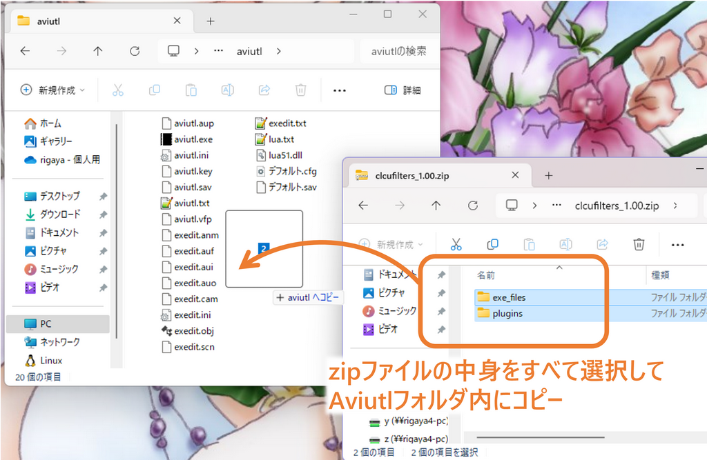
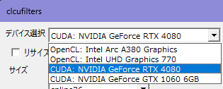
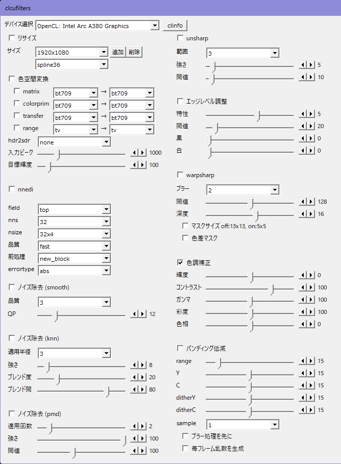

# clcufilters

clcufilters.auf は、Aviutl用のGPUフィルタです。複数のフィルタ処理をGPU上で連続して行うことで、フィルタをそれぞれ実行するのと比べてCPU - GPU間のデータ転送を削減でき、高速化が期待できます。

処理本体は別プロセスで行うつくりとなっており、NVIDIA GPUではcufilters.exeによりCUDAでフィルタ処理を、それ以外(Intel/AMD)のGPUではclfilters.exeによりOpenCLでフィルタ処理を行います。


これにより、

- Aviutl本体プロセスのメモリ使用量削減
- プロセス分離による安定性向上
- 特にCUDA関連の64bitプロセスでしか使用できない機能の活用

といったことを狙います。

## 想定動作環境

Windows 10/11 (x64)  
Aviutl 1.00 以降  
Intel / NVIDIA / AMD のGPUドライバのインストールされた環境  

NVIDIAドライバは452.39以降に対応

32bit OSでは使用できません。

## clcufilters 使用にあたっての注意事項

無保証です。自己責任で使用してください。clcufiltersを使用したことによる、いかなる損害・トラブルについても責任を負いません。  

今後の更新でプロファイルの互換性がなくなるかもしれません。  
※非常にありえます。

## 使用方法

ダウンロードしたら、zipファイルの中身をすべてAviutlフォルダにコピーしてください。



Aviutlを起動して設定画面を開き、使用するデバイスを選択してください。iGPU / dGPUどちらも利用可能です。

右側の [clinfo] ボタンでOpenCLの認識するGPUデバイスの詳細情報をテキストファイルに出力できます。



その後、適用するフィルタにチェックを入れ、パラメータ調整を行ってください。標準値は下記のとおりです。



## "OpenCLを使用できません。" と出てしまう

問題の確認方法、対処方法をまとめました。[こちら](./opencl_load_error.md)をご確認ください。

## 設定画面の詳細

### デバイス選択  
使用するデバイス(GPU)を選択します。

### clinfo  
現環境で認識しているデバイスのリストとその情報を指定のファイルに出力します。

### ログ出力  
ログ出力の段階を選択します。通常は、"quiet"で問題ありません。

quiet以外を選択した場合、ログは[patch.aul](https://www.nicovideo.jp/watch/sm39491708)等により表示可能なコンソールウィンドウに出力されます。また、「ファイルに出力」のチェックを入れることで、"cufilter.auf.log"にファイル出力することも可能です。

### フィルタ順序  


フィルタの適用順を並べ替えることができます。適用順を入れ替えたいフィルタを選択し、上下ボタンで移動してください。

---
### リサイズ  
リサイズのアルゴリズムを指定できる。

- **パラメータ**
  - CUDA/OpenCLで実装したリサイズフィルタ

    | オプション名 | 説明 |
    |:---|:---|
    | spline16 | 4x4 Spline補間 |
    | spline36 | 6x6 Spline補間 |
    | spline64 | 8x8 Spline補間 |
    | lanczos2 | 4x4 lanczos補間 |
    | lanczos3 | 6x6 lanczos補間 |
    | lanczos4 | 8x8 lanczos補間 |
    | bilinear | 線形補間 |
    | bicubic  |  双三次補間 |

  - [nvvfx](https://github.com/NVIDIA/MAXINE-VFX-SDK)ライブラリのリサイズフィルタ

    | 名前 | 説明 |
    |:---|:---|
    | nvvfx-superres | NVIDIA Video EffectsによるSuper Resolution (拡大のみ)  |  |

    このモードは、[NVIDIA MAXINE VideoEffects SDK](https://github.com/NVIDIA/MAXINE-VFX-SDK)によるAIによって拡大処理を行うので、
    実行にはx64版の実行ファイルとTuring世代(RTX20xx)以降のGPUが必要。
    また、あわせて[MAXINE VideoEffects 用のモデルと実行モジュール](https://www.nvidia.com/broadcast-sdk-resources)をダウンロード・インストールしてからお使いください。

    2160p までの入力解像度に対応している。
      
    - 追加パラメータ
      - superres-mode=&lt;int&gt;
        nvvfx-superres のモードの選択。
        - 0 ... 弱め (default)
        - 1 ... 強め
      
      - superres-strength
        nvvfx-superresの強さの指定。 (0 - 100)

  - [NGX](https://docs.nvidia.com/rtx/ngx/programming-guide/index.html)ライブラリのリサイズフィルタ
  
    実行にはx64版の実行ファイルとTuring世代(RTX20xx)以降のGPU、そして550.58以降のドライバが必要。
 
    | 名前 | 説明 |
    |:---|:---|
    | ngx-vsr       | NVIDIA VSR (Video Super Resolution)  |  |

    - 追加パラメータ
      - vsr-quality
        ngx-vsr使用時の品質の設定。 (デフォルト=1, 1 - 4)  
        数字が大きいほど高品質。

  - [libplacebo](https://code.videolan.org/videolan/libplacebo)ライブラリのリサイズフィルタ
  
    | 名前 | 説明 |
    |:---|:---|
    | libplacebo-spline16      | 4x4 Spline補間                       |
    | libplacebo-spline36      | 6x6 Spline補間                       |
    | libplacebo-spline64      | 8x8 Spline補間                       |
    | libplacebo-nearest       | 最近傍点選択                         |
    | libplacebo-bilinear      | 線形補間                             |
    | libplacebo-gaussian      | ガウス補間                           |
    | libplacebo-sinc          | Sinc補間                             |
    | libplacebo-lanczos       | Lanczos補間                          |
    | libplacebo-ginseng       | Ginseng補間                          |
    | libplacebo-ewa-jinc      | EWA Jinc補間                         |
    | libplacebo-ewa-lanczos   | EWA Lanczos補間                      |
    | libplacebo-ewa-lanczossharp | EWA Lanczos Sharp補間             |
    | libplacebo-ewa-lanczos4sharpest | EWA Lanczos 4 Sharpest補間    |
    | libplacebo-ewa-ginseng  | EWA Ginseng補間                       |
    | libplacebo-ewa-hann     | EWA Hann補間                          |
    | libplacebo-ewa-hanning  | EWA Hanning補間                       |
    | libplacebo-bicubic      | 双3次補間                             |
    | libplacebo-triangle     | 三角補間                              |
    | libplacebo-hermite      | Hermite補間                           |
    | libplacebo-catmull-rom  | Catmull-Rom補間                       |
    | libplacebo-mitchell     | Mitchell補間                          |
    | libplacebo-mitchell-clamp | Mitchell Clamp補間                  |
    | libplacebo-robidoux     | Robidoux補間                          |
    | libplacebo-robidouxsharp | Robidoux Sharp補間                   |
    | libplacebo-ewa-robidoux | EWA Robidoux補間                      |
    | libplacebo-ewa-robidouxsharp | EWA Robidoux Sharp補間           |

    - 追加パラメータ

      > [!NOTE]
      > clamp, taper, antiringは、QSV/NV/VCEEncの100倍の値で指定します。
      
      - clamp=&lt;float&gt;

        libplacebo-resampleで使用される負の重みに対するクランプ係数。100にすると負の重みが0になります。(0 - 100、デフォルト = 0)
      
      - taper=&lt;float&gt;

        libplacebo-resampleの重み関数の中心部分を平坦化します。(0 - 100、デフォルト = 0)
      
      - blur=&lt;float&gt;

        libplacebo-resampleの追加のぼかし係数。(0 - 100、デフォルト = 0)
      
      - antiring=&lt;float&gt;

        libplacebo-resampleのアンチリンギング強度。(0 - 100、デフォルト = 0)

---
### 色空間変換  
指定の色空間変換を行う。

- **パラメータ**
  - matrix=&lt;変換元&gt;→&lt;変換先&gt;  
    
  ```
    bt709, smpte170m, bt470bg, smpte240m, YCgCo, fcc, GBR, bt2020nc, bt2020c
  ```
  
  - colorprim=&lt;変換元&gt;→&lt;変換先&gt;  
  ```
    bt709, smpte170m, bt470m, bt470bg, smpte240m, film, bt2020
  ```
  
  - transfer=&lt;変換元&gt;→&lt;変換先&gt;  
  ```
    bt709, smpte170m, bt470m, bt470bg, smpte240m, linear,
    log100, log316, iec61966-2-4, iec61966-2-1,
    bt2020-10, bt2020-12, smpte2084, arib-std-b67
  ```
  
  - range=&lt;変換元&gt;→&lt;変換先&gt;  
  ```
    tv, full
  ```
  
  
  - hdr2sdr  
    tone-mappingを指定してHDRからSDRへの変換を行う。使用時には、matrix, colorprim, transfer 等の変換も同時に適切に指定してください。
    
    - none  (デフォルト)  
      hdr2sdrの処理を行うない。
  
    - hable    
      明部と暗部のディテールの両方をバランスよく保ちながら変換する。(ただし、やや暗めになる)
  
    - mobius  
      なるべく画面の明るさやコントラストを維持した変換を行うが、明部のディテールがつぶれる可能性がある。
    
    - reinhard  
        
    - bt2390  
      BT.2390で規定されるtone mapping。
  
  
  - 入力ピーク  (デフォルト= 1000)  
  
  - 目標輝度  (デフォルト= 100)  

---
### tonemap (libplacebo)

[libplacebo](https://code.videolan.org/videolan/libplacebo)を使用したトーンマッピングを行います。

- **パラメータ**
  - src_csp
    入力の色空間を指定します。
    ```
    auto, sdr, hdr10, hlg, dovi, rgb
    ```
  
  - dst_csp
    出力の色空間を指定します。
    ```
    auto, sdr, hdr10, hlg, dovi, rgb
    ```

  - src_max
    入力の最大輝度 (nits)。

  - src_min
    入力の最小輝度 (nits)。

  - dst_max
    出力の最大輝度 (nits)。

  - dst_min
    出力の最小輝度 (nits)。

  - smooth_period
    スムージング係数。デフォルト: 20.0

  - scene_threshold_low
    シーン変更検出の下限閾値 (dB)。デフォルト: 1.0

  - scene_threshold_high
    シーン変更検出の上限閾値 (dB)。デフォルト: 3.0

  - percentile
    輝度ヒストグラムの考慮するパーセンタイル。デフォルト: 99.995

  - black_cutoff
    黒レベルのカットオフ強度 (PQ%)。デフォルト: 1.0

  - gamut_mapping
    ガンママッピングモード。 (デフォルト: perceptual)
    ```
    clip, perceptual, softclip, relative, saturation, absolute, desaturate, darken, highlight, linear
    ```

  - tonemapping_function
    トーンマッピング関数。 (デフォルト: bt2390)
    ```
    clip, st2094-40, st2094-10, bt2390, bt2446a, spline, reinhard, mobius, hable, gamma, linear, linearlight
    ```

  - tonemapping_function=st2094-40, st2094-10, splineの場合  
  
    - knee_adaptation (float, 0.0 - 1.0, デフォルト: 0.4)  
      PQ空間における入力と出力の平均輝度の比率としてニーポイントを設定します。
      - 1.0: 常に入力シーンの平均を調整された出力の平均に適応させます
      - 0.0: シーンの輝度を一切変更しません
    
    - knee_min (0.0 - 0.5, デフォルト: 0.1)  
      PQ輝度範囲の比率における最小ニーポイント。
    
    - knee_max (0.5 - 1.0, デフォルト: 0.8)  
      PQ輝度範囲の比率における最大ニーポイント。
    
    - knee_default (knee_min - knee_max, デフォルト: 0.4)  
      入力シーンの平均メタデータが利用できない場合に使用されるデフォルトのニーポイント。
  
  - tonemapping_function=bt2390の場合

    - knee_offset (0.5 - 2.0, デフォルト: 1.0)  
      ニーポイントのオフセット。
  
  - tonemapping_function=splineの場合

    - slope_tuning (0.0 - 10.0, デフォルト: 1.5)  
      スプライン曲線の傾きの係数。
    
    - slope_offset (0.0 - 1.0, デフォルト: 0.2)  
      スプライン曲線の傾きのオフセット。
    
    - spline_contrast (0.0 - 1.5, デフォルト: 0.5)  
      スプライン関数のコントラスト。高い値は中間調を保持しますが、影や高輝度部分の詳細を失う可能性があります。
  
  - tonemapping_function=reinhardの場合

    - reinhard_contrast (0.0 - 1.0, デフォルト: 0.5)  
      reinhard関数のディスプレイピークにおけるコントラスト係数。
  
  - tonemapping_function=mobius, gammaの場合

    - linear_knee (0.0 - 1.0, デフォルト: 0.3)  
  
  - tonemapping_function=linear, linearlightの場合

    - exposure (0.0 - 10.0, デフォルト: 1.0)  
      適用される線形露出/ゲイン。

  - metadata
    トーンマッピングに使用するデータソース。
    ```
    any, none, hdr10, hdr10plus, cie_y
    ```

  - contrast_recovery
    コントラスト回復強度。デフォルト: 0.3

  - contrast_smoothness
    コントラスト回復のローパスカーネルサイズ。デフォルト: 3.5

  - transfer
    出力の転送関数。```colorprim```と一緒に使用する必要があります。
    ```
    unknown, srgb, bt1886, linear, gamma18, gamma20, gamma22, gamma24, gamma26, gamma28,
    prophoto, st428, pq, hlg, vlog, slog1, slog2
    ```

  - colorprim
    出力の色域。```transfer```と一緒に使用する必要があります。
    ```
    unknown, bt601_525, bt601_625, bt709, bt470m, ebu_3213, bt2020, apple, adobe,
    prophoto, cie_1931, dci_p3, display_p3, v_gamut, s_gamut, film_c, aces_ap0, aces_ap1
    ```

---
### nnedi  
nnediによるインタレ解除を行う。基本的には片方フィールドは捨てて、もう片方のフィールドから
ニューラルネットを使って輪郭を補正しながらフレームを再構築することでインタレ解除するが、とても重い…。

- **パラメータ**
  - field  
    インタレ解除の方法。
    - top  
      トップフィールド維持
    - bottom  
      ボトムフィールド維持
  
  - nns  (デフォルト= 32)  
    ニューラルネットのニューロン数。
    - 16, 32, 64, 128, 256
  
  - nsize  (デフォルト= 32x4)  
    ニューラルネットが参照する近傍ブロックのサイズ。
    - 8x6, 16x6, 32x6, 48x6, 8x4, 16x4, 32x4
  
  - 品質  (デフォルト= fast)  
  
    - fast
  
    - slow  
      slowではfastのニューラルネットの出力に、もうひとつの
      ニューラルネットの出力をブレンドして品質を上げる(当然その分さらに遅い)。
  
  - 前処理 (デフォルト= new_block)  
    事前に前処理を行い、単純な補間で済ますか、ニューラルネットでの補正を行うか決定する。
    基本的にはエッジ近傍がニューラルネットでの補正の対象となり、ニューラルネットを使う頻度が下がることで処理が高速になる。
    
    - none  
      前処理を行わず、すべてのpixelをニューラルネットで再構成する。
  
    - original
    - new  
      前処理を行い、必要なところのみニューラルネットでの補正を行うようにする。originalとnewは方式が異なる。newのほうが速くなる傾向にある。
  
    - original_block
    - new_block  
      original/newのGPU最適化版。pixel単位の判定の代わりにブロック単位の判定を行う。
  
  - errortype (デフォルト= abs)  
    ニューラルネットの重みパラメータを選択する。
    - abs  
      絶対誤差を最小にするよう学習された重みを用いる。
    - square  
      二乗誤差を最小にするよう学習された重みを用いる。

---
### ノイズ除去 (nvvfx-denoise)
[NVIDIA MAXINE VideoEffects SDK](https://github.com/NVIDIA/MAXINE-VFX-SDK)による、元映像の詳細の保持しながらノイズの除去を行う。
主にウェブカメラによるノイズの除去を主眼とする。

80p - 1080p までの入力解像度に対応しており、実行にはNVIDIAのTuring世代(RTX20xx)以降のGPUが必要。
また、あわせて[MAXINE VideoEffects 用のモデルと実行モジュール](https://www.nvidia.com/broadcast-sdk-resources)をダウンロード・インストールしてからお使いください。

- **パラメータ**
  - 強度=&lt;int&gt;
    - 0 - light 
      弱めの効果で元映像の詳細の保持を重視する.

    - 1 - strong
      強めの効果でノイズ除去を重視する。

---
### ノイズ除去 (nvvfx-artifact-reduction)
[NVIDIA MAXINE VideoEffects SDK](https://github.com/NVIDIA/MAXINE-VFX-SDK)による映像の圧縮劣化を低減するフィルタ。
オリジナルの動画の情報を保存しながら、入力ファイルのエンコード時の圧縮劣化を低減する。

90p - 1080p までの入力解像度に対応しており、実行にはNVIDIAのTuring世代(RTX20xx)以降のGPUが必要。
また、あわせて[MAXINE VideoEffects 用のモデルと実行モジュール](https://www.nvidia.com/broadcast-sdk-resources)をダウンロード・インストールしてからお使いください。

- **parameters**
  - モード=&lt;int&gt;
    - 0 - light (default)  
      弱めの効果で副作用を抑える。もとのファイルが比較的高ビットレートの場合に適している。

    - 1 - strong
      より効果を強くし、圧縮劣化の低減する。もとのファイルが低ビットレートで劣化が激しい場合に適している。

---
### ノイズ除去 (smooth)  

- **パラメータ**
  - 品質  (デフォルト=3, 1-6)  
    処理の品質。値が大きいほど高精度だが遅くなる。
  
  - QP  (デフォルト=12, 1 - 63)    
    フィルタの強さ。

---
### ノイズ除去 (denoise dct)

  もう一つのDCTベースのノイズ除去フィルタ。

> [!NOTE]
> sigmaは、QSV/NV/VCEEncの10倍の値で指定します。

- **パラメータ**
  - 品質  
    処理の品質。値が小さいほど高精度だが遅くなる。  
    - 1 (high quality, slow)
    - 2 (default)
    - 4
    - 8 (fast)
  
  - sigma  (default=40, 0 - 500)    
    フィルタの強さ。値が大きいほど強さが増すが、輪郭がぼける等の副作用も強くなる。
    
  - ブロックサイズ (default=8)  
    - 8
    - 16 (slow)

---
### ノイズ除去 (knn)  
強めのノイズ除去を行う。

> [!NOTE]
> 強さ、ブレンド度、ブレンド閾は、QSV/NV/VCEEncの100倍の値で指定します。

- **パラメータ**
  - 適用半径  (デフォルト=3, 1-5)  
  
  - 強さ  (デフォルト=8, 0 - 100)  
    フィルタの強さ。
  
  - ブレンド度  (デフォルト=20, 0 - 100)  
    ノイズ除去ピクセルへのオリジナルピクセルのブレンド度合い。
  
  - ブレンド閾   (デフォルト=80, 0 - 100)  
    エッジ検出の閾値。

---
### ノイズ除去 (nlmeans)  
Non local meansを用いたノイズ除去フィルタ。

> [!NOTE]
> sigmaとhは、QSV/NV/VCEEncの1000倍の値で指定します。

- **パラメータ**
  - sigma  (default=5, 0 - )   
    ノイズの分散。 より大きな値にするとより強くノイズ除去を行う。
  
  - h  (default=50, 1 - )   
    パラメータ。 値を大きくすると重みがより均一になる。
  
  - patch (default=5, 3 - 21)  
    パッチのサイズ。
  
  - search (default=11, 3 - 21)  
    探索範囲。

---
### ノイズ除去 (pmd)  
正則化pmd法によるノイズ除去。弱めのノイズ除去を行いたいときに使用する。

- **パラメータ**
  - 適用回数  (デフォルト=2, 1- )  
    適用回数。デフォルトは2。
  
  - 強さ  (デフォルト=100, 0-100)  
    フィルタの強さ。
  
  - 閾値  (デフォルト=100, 0-255)  
    フィルタの輪郭検出の閾値。小さいほど輪郭を保持するようになるが、フィルタの効果も弱まる。

---
### unsharp  
輪郭・ディテール強調用のフィルタ。

- **パラメータ**
  - 範囲 (デフォルト=3, 1-9)  
    輪郭・ディテール検出の範囲。より大きな値とすることで、より広い範囲のディテールに反応して強調をかけるようになる。
  
  - 強さ (デフォルト=0, 0-100)  
    輪郭・ディテール強調の強さ。より大きな値とすることで、強く強調がかかる。
  
  - 閾値 (デフォルト=10, 0-255)  
    輪郭・ディテール検出の閾値。閾値以上の差異がある画素に対して、輪郭強調を行う。

---
### エッジレベル調整  
輪郭強調用のフィルタ。

- **パラメータ**
  - 特性 (デフォルト=5, -31 - 31)  
    輪郭強調の強さ。より大きな値とすることで、輪郭強調が強力になる。
  
  - 閾値 (デフォルト=20, 0 - 255)  
    輪郭強調を行わないようにするノイズの閾値。より大きな値ほど大きな輝度の変化をノイズとして扱うようになる。
  
  - 黒 (デフォルト=0, 0-31)  
    輪郭の黒い部分について、より黒くシュートさせて輪郭を強調するようにする。
  
  - 白 (デフォルト=0, 0-31)  
    輪郭の白い部分について、より白くシュートさせて輪郭を強調するようにする。

---
### warpsharp  
細線化フィルタ。輪郭調整用のフィルタ。

- **パラメータ**
  - ブラー  (デフォルト=2)  
    blur処理を行う回数。値をあげるほどフィルタの強度が弱まる。
  
  - 閾値 (デフォルト=128, 0 - 255)  
    輪郭検出の閾値。値をあげるほどフィルタの強度が強まる。
    
  - 深度 (デフォルト=16, -128 - 128)  
    warpの深度。値をあげるほどフィルタの強度が強まる。
  
  - マスクサイズ  (デフォルト=オフ)  
    - オフ ... 13x13のblur処理を行う。
    - オン ... 5x5のblur処理を行う。より高品質だが、blur回数を多めにする必要がある。
    
  - 色差マスク  (デフォルト=オフ)  
    色差の処理方法の指定。
    - オフ ... 輝度ベースの輪郭検出を色差成分にも適用する。
    - オン ... 各色差成分についてそれぞれ輪郭検出を行う。

---
### 色調補正  

- **パラメータ**
  - 輝度 (デフォルト=0, -100 - 100)  
  
  - コントラスト (デフォルト=100, -200 - 200)  
  
  - ガンマ (デフォルト=100, 1 - 200)  
  
  - 彩度 (デフォルト=100, 0 - 200)  
  
  - 色相 (デフォルト=0, -180 - 180)  

---
### バンディング低減  
グラデーション等が階段状になってしまうバンディングを低減するフィルタ。

- **パラメータ**
  - range=&lt;int&gt; (デフォルト=15, 0-127)  
    ぼかす範囲。この範囲内の近傍画素からサンプルを取り、ブラー処理を行う。
  
  - Y=&lt;int&gt; (デフォルト=15, 0-31)
  - C=&lt;int&gt; (デフォルト=15, 0-31)  
    y,cb+cr 各成分の閾値。この値が高いと階調飛びを減らす一方で、細かい線などが潰れやすくなる。
  
  - dither_y=&lt;int&gt; (デフォルト=15, 0-31)
  - dither_c=&lt;int&gt; (デフォルト=15, 0-31)  
    y成分と cb+cr成分のディザの強さ。
  
  - sample=&lt;int&gt; (デフォルト=1, 0-2)  
    - 設定値：0  
      周辺1画素を参照し、元の画素値を維持したまま処理を行う。
  
    - 設定値：1  
      周辺1画素とその点対称画素の計2画素を参照し、ブラー処理を行う。
  
    - 設定値：2  
      周辺2画素とその点対称画素の計4画素を参照し、ブラー処理を行う。
  
  
  - ブラー処理を先に (デフォルト=オフ)  
    ブラー処理を先にすることでディザ強度を減らしつつ、階調飛びが多い素材での効果を上げる。
    全体的に副作用が強くなり細かい線が潰れやすくなる。
  
  - 毎フレーム乱数生成 (デフォルト=オフ)  
    毎フレーム使用する乱数を変更する。

---
### バンディング低減 (libplacebo)  

  [libplacebo](https://code.videolan.org/videolan/libplacebo)を使用したバンディング低減フィルタ。

> [!NOTE]
> thresholdは、QSV/NV/VCEEncの10倍の値で指定します。

- **パラメータ**
  - iterations
    イテレーション数。 (デフォルト=1, 0-)

  - threshold
    カットオフ閾値。 (デフォルト=40, 0-)

  - radius
    半径 (デフォルト=16.0, 0-)

  - grain_y
    輝度用の追加ノイズ。 (デフォルト=6.0, 0-)

  - grain_c
    色差用の追加ノイズ。 (デフォルト=grain_y, 0-)

  - dither
    ディザリングモード、8bitのみ。
    - none
    - blue_noise (default)
    - ordered_lut
    - ordered_fixed
    - white_noise

  - lut_size
    ディザリング用のLUTのサイズ。 (デフォルト=64)  
    ```2, 4, 8, 16, 32, 64, 128, 256 ```

---
### NGX TrueHDR
RTX Video SDKを使用したAIベースのSDR→HDR変換を行う。出力はcolormatrix BT.2020に変換される。使用時にはエンコーダ側で ```--colormatrix bt2020nc --colorprim bt2020 --transfer smpte2084``` の指定を推奨。

Turing以降のGPUかつ、Windows x64版で550.58以降のドライバが必要。

- **パラメータ**
  - contrast(デフォルト=100, 0 - 200)  
    明暗のコントラスト比の調整。

  - saturation(デフォルト=100, 0 - 200)  
    色の濃さの調整。

  - middlegray(デフォルト=50, 10 - 100)  
    平均の明るさの調整。

  - maxluminance(デフォルト=1000, 400 - 2000)  
    最大輝度(nits)の指定。

---
## 処理概要

Aviutlの内部フォーマット(YC48)からGPUで扱いやすいYUV444 16bitに変換したのち、GPUに転送してフィルタ処理を行います。その後、処理結果をCPUに転送し、YC48に戻して処理を完了させます。[]内の処理は別プロセスで行います。

YC48 → [ YUV444 16bit → GPUに転送 → VppフィルタをGPUで連続処理 → CPUに転送 → YUV444 16bit ] → YC48

## GPUフィルタの高速化

### GPUフィルタの課題

GPUで高速にフィルタ処理ができたとしても、残念ながらGPUフィルタが高速とは限りません。

- CPU-GPU間転送が遅い  
  Aviutlでは基本的にはフレームのデータがCPUにあるため、GPUフィルタを適用する場合、CPU-GPU間の通信が必要になります。ところがこれはかなり遅い処理で、転送開始のレイテンシも大きいし、転送にも時間がかかります。

- そもそもGPUでの計算開始が遅い。  
  直ちに計算を行ってくれるCPUと異なり、GPUに計算を発行してから実際に開始されるまでにそれなりの遅延があります。

CPU-GPU間転送や、GPUの処理開始遅延の影響で、計算を直列に並べると、フィルタによっては普通にCPU版をAVX2とかで最適化したほうが高速ということになってしまいます。GPU版を高速にするためには、

- CPU-GPU間転送を減らす
- CPU-GPU間転送やGPU計算を並行して実行する

などの対策が必要になります。

### 実施済みの最適化

下記の最適化は行いましたが、まだ最適化の余地はあると思います。

#### CPU-GPU間転送を減らす

複数のGPUフィルタを一度に適用することで、CPU-GPU間転送を削減しています。GPUフィルタをひとつひとつ適用するのに比べ、転送回数を減らすことができます。

#### 内蔵GPU使用時のCPU-GPU間転送の削減

Intel GPUなど、内蔵GPUを使用する場合、OpenCLのAPIを適切に使うことでCPU-GPU間転送をなくすようにしました (いわゆるZero Copy)。

#### CPU-GPU間転送とGPU計算を並行して実行

保存時にはフレームを先読みすることで、CPU-GPU間転送とGPU計算を並行して行うことで、CPU-GPU間転送や処理開始の遅延を抑制しています。(実装の単純化のため、保存時のみ行っており、編集時は行っていません。)

#### メモリ確保・再確保の削減

GPUのメモリ確保はCPU以上に遅いので、なるべく確保したメモリを使いまわすように工夫しました。

#### 不要な同期の削除

まだGPUが遊んでいる時間が多い状況だったので、VTuneなどを使って、OpenCL APIの呼ばれ方などをチェックしました。リソースの解放漏れにより、無駄な同期がかかってしまっていたのを解消して高速化しました。

## 課題

clcufilters には下記の課題があります。

- 時間方向に参照するフィルタに未対応  
  vpp-convolution3d など。かなり実装がややこしくなってしまうので見送り中です。

## お知らせ

- nvvfx フィルタは、NVIDIA BROADCASTを使用しています。
  

## コンパイル環境

VC++ 2019/2022 + CUDA 11 - 12

ビルド方法は[こちら](./Build.md)。

