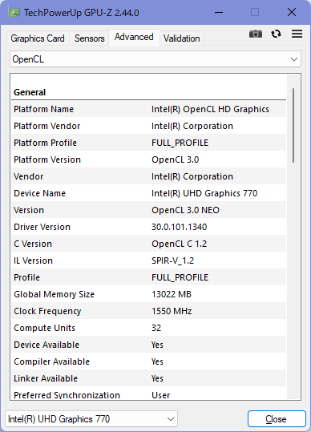

# clfiltersで "OpenCLを使用できません。" と出てしまう場合の対応

まず、OpenCLが使用可能となっているか確認します。

## GPU-Zでの確認

[GPU-Z](https://www.techpowerup.com/gpuz/)の[Advanced]タブからOpenCLを選択し、下記のように情報が表示されるか確認してください。

このように適切に認識されているにもかかわらず、clfiltersで"OpenCLを使用できません。"と出てしまう場合は、clfiltersの問題と思われますので、ご連絡ください。



"not supported" と表示されている場合は、OpenCLに対応していないデバイスであるか、なんらかの原因でOpenCLが適切に認識されていません。

## モジュールの確認

まず、```C:\Windows\SysWOW64\OepnCL.dll``` が存在するか確認してください。

また、使用するGPUに応じて下記のモジュールが存在するか確認してください。

| ベンダー | モジュール(32bit) | 場所 |
|:--       |:--                |:--   |
| Intel    | igdrcl32.dll      | C:\Windows\System32\DriverStore\FileRepository\iigd_dch.inf_amd64_*  |
| NVIDIA   | nvopencl32.dll    | C:\Windows\System32\DriverStore\FileRepository\nv_dispig.inf_amd64_* |
| AMD      | amdocl.dll        | C:\Windows\System32\DriverStore\FileRepository\xxxxxxxx.inf_amd64_*  |

## モジュールが存在しない場合

これらが存在しない場合は、まずはGPUドライバパッケージをダウンロードし、クリーンインストールを行ってください。

PC再起動後、問題が解消するか確認してください。

## モジュールが存在するが、OpenCLが有効にならない場合

**下記操作はレジストリを操作するため、自己責任で十分注意して行ってください。**

レジストリエディタ(regedit)を開き、下記キーを追加してください。

```
レジストリキー HKEY_LOCAL_MACHINE\SOFTWARE\WOW6432Node\Khronos\OpenCL\Vendors

[新規] > [DWORD (32bit) 値]
名前: モジュールへのフルパス
種類: REG_DWORD
データ: 0x00000000 (0)
```

PC再起動後、問題が解消するか確認してください。

# OpenCLモジュールのロードの仕組み

OpenCLは、本来はGPUに限らず並列計算を行うための汎用的な仕組みになっており、複数のベンダーがサポートしています。(Intel, NVIDIA, AMD, ...)

これをサポートするため、OpenCLモジュールについても同一PCで複数のベンダーのOpenCLデバイスを利用できるよう、以下のような仕組みになっています。

アプリケーションが使用するOpenCLモジュールは、OpenCL.dllですが、これは一般にはICDローダーと呼ばれるもので、
これがさらに各デバイス用の実装の実体となるモジュールをロードして呼び出してOpenCLを実行することになります。

この「各デバイス用の実装の実体となるモジュール」は一般的には各ベンダーのGPUドライバに含まれています。

| ベンダー | モジュール(32bit) | モジュール(64bit) | 場所 |
|:--       |:--                |:--                |:--   |
| Intel    | igdrcl32.dll      | igdrcl64.dll      | C:\Windows\System32\DriverStore\FileRepository\iigd_dch.inf_amd64_*  |
| NVIDIA   | nvopencl32.dll    | nvopencl64.dll    | C:\Windows\System32\DriverStore\FileRepository\nv_dispig.inf_amd64_* |
| AMD      | amdocl.dll        | amdocl64.dll      | C:\Windows\System32\DriverStore\FileRepository\xxxxxxxx.inf_amd64_*  |

OpenCL.dllが呼び出されると、OpenCL.dllがこれらモジュールを見つけに行くことになります。
一般にはGPUドライバインストール時にレジストリに各モジュールの場所が書き込まれており、
OpenCL.dllがこの値を参照してロードしているようです。

レジストリを検索すると複数あるので、どれを参照しているのかよくわからないですが…。

```
HKEY_LOCAL_MACHINE\SYSTEM\ControlSet001\Control\Class\{xxxxxxxx-xxxx-xxxx-xxxx-xxxxxxxxxxxx}\yyyy
32bit: OpenCLDriverNameWow
64bit: OpenCLDriverName
```

それとは別に、OpenCLの検索用レジストリキーとして下記も用意されています。

こちらにキーを下記のように登録すると、そのモジュールを探しに行ってくれます。手動での登録の際には、こちらを使うのがよさそうです。

ただ、手動の場合、ドライバを更新するたびに再設定が必要になるかもしれないので、
基本的にはドライバセットアップに任せるほうがよく、それでうまくいかない場合にのみ使用したほうがよいでしょう。

```
32bit: HKEY_LOCAL_MACHINE\SOFTWARE\WOW6432Node\Khronos\OpenCL\Vendors
64bit: HKEY_LOCAL_MACHINE\SOFTWARE\Khronos\OpenCL\vendors

新規キーの追加
    名前: モジュールへのフルパス
    種類: REG_DWORD
    データ: 0x00000000 (0)
```

ちょっとややこしいのですが、このあたりはOpenCLが汎用的でオープンな仕組みであるため、仕方ない面だと思います。

クローズドなCUDAとは対照的で、あちらはNVIDIAに閉じているのでシンプルになっている一方、基本的にはNVIDIAでしか使えないです。

どちらがいいということではなく、想定する用途・使われ方によって、良し悪しは異なると思います。
